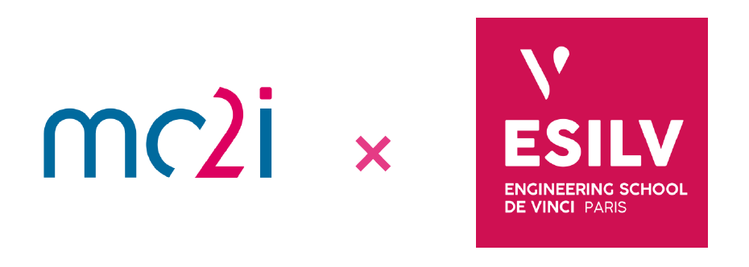

# Analysis-and-Optimization-of-Energy-Consumption
This project is part of the **Explainability AI** course. 

## Context
Against a backdrop of energy transition and global warming, companies and organizations need to reduce their environmental impact while optimizing their resources. Controlling energy consumption is a strategic factor in meeting these global challenges.

## Members of the project
- Ngoulaye KEUNGUEU
- Djibril LALEG
- Lisa NACCACHE
- Ismaël KONE
- Kylie WU
- Leina PRIEUR
- Ilan ZINI

## Link to our dashboard (PowerBI)
https://app.powerbi.com/links/4K5zs9UYjm?ctid=88eebcae-d6e6-4ef7-bba4-4c34f4c2d5e0&pbi_source=linkShare 